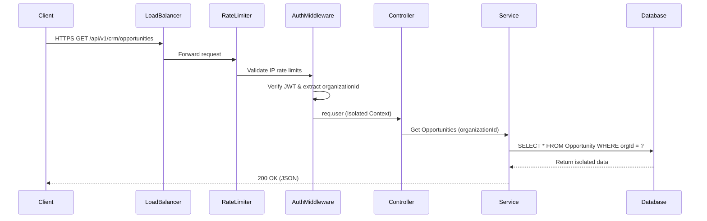
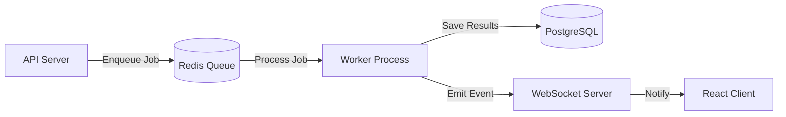
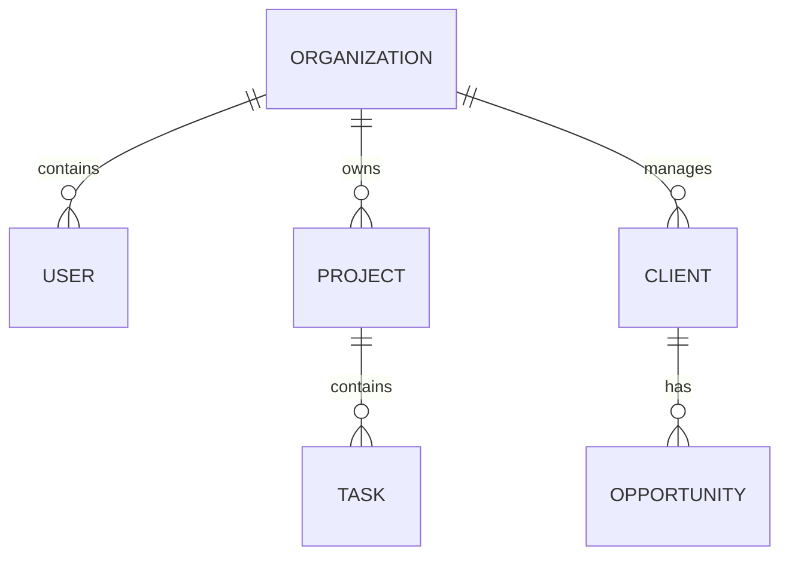

# Architecture Deep Dive

## High-Level Request Flow
When a client makes a request, it passes through several layers of security and isolation before touching business logic.

## Background Job Processing (BullMQ)
Heavy tasks are offloaded to Redis-backed queues to keep the HTTP API responsive.

## Database Schema Highlights
The schema is built around the `Organization` to enforce multi-tenancy.

